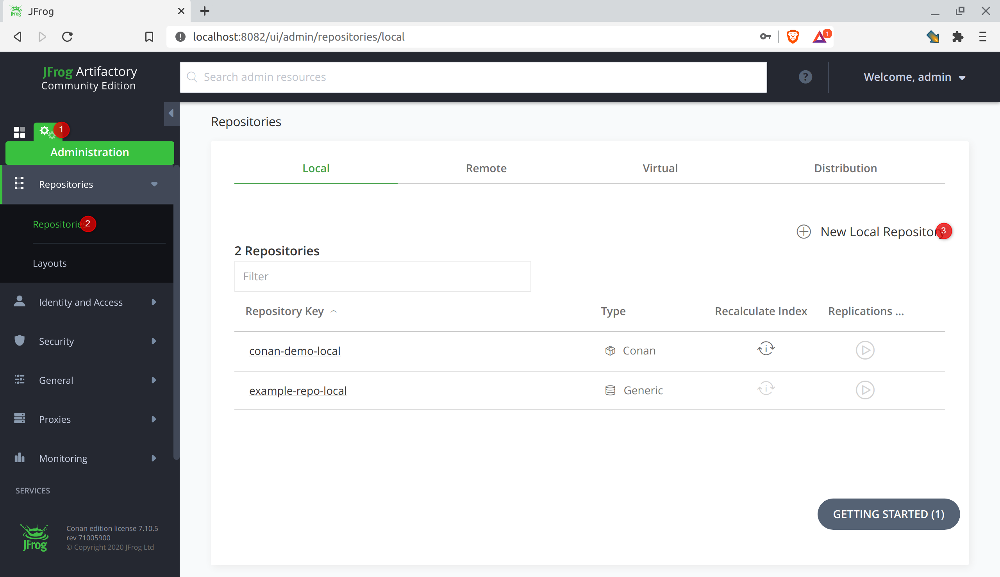
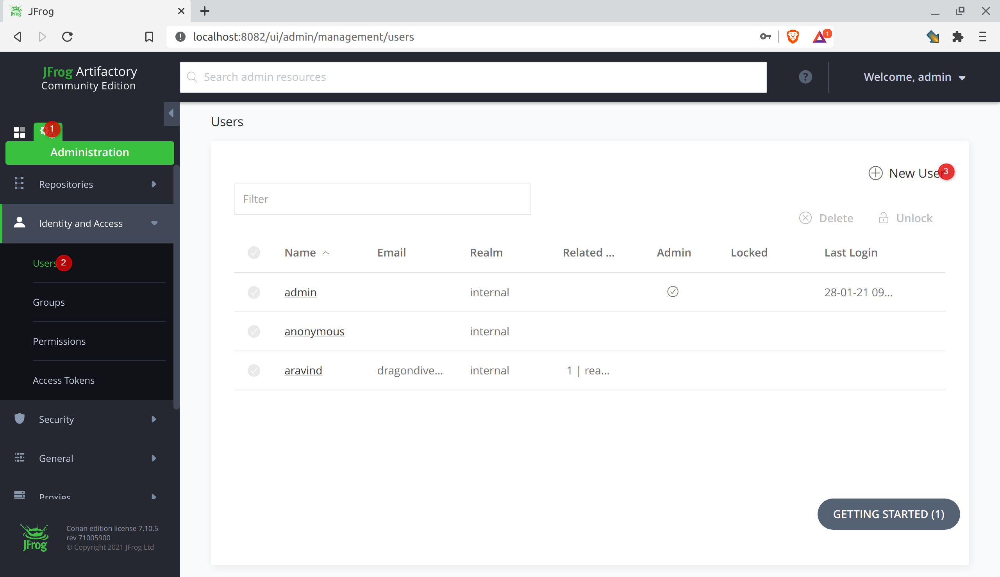
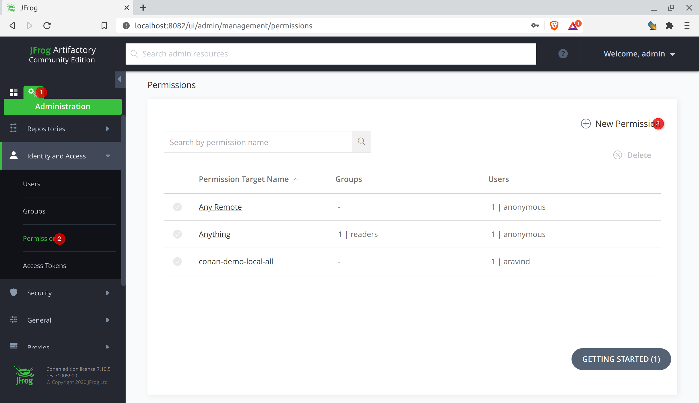
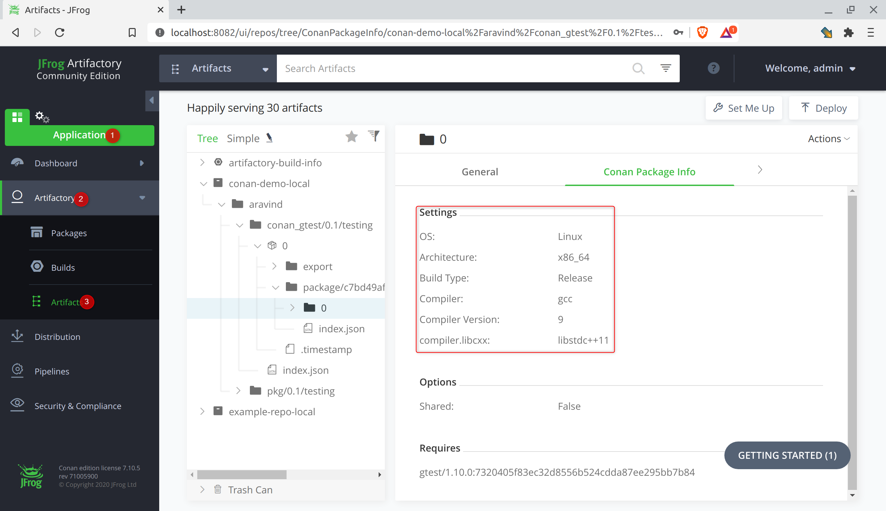

Publishing `conan` package to artifactory
=========================================

To enable conan packages to be used by others, it needs to be published. The [JFrog artifactory](https://jfrog.com/artifactory/) is the de facto standard server for publishing `conan` artifacts, as well as for many other types of artifacts.

Installing JFrog artifactory
----------------------------

Conan artifacts would be usually uploaded to an artifactory hosted on a remote server. For the demo and learning purpose, I install it on the local machine and get on with it.

The JFrog artifactory community edition is available for download on [Conan's downloads page](https://conan.io/downloads.html). As I use Linux Mint, I download the Debian package and install it. Then I start the artifactory:

    sudo service artifactory start

The artifactory web server is available on `localhost:8081`.

Creating repository, user account, and permissions on the artifactory
------------------------------------------------------------------------

To publish conan packages to the artifactory, we need to create a conan repository. While artifactory allows anonymous publishing, we also create user accounts and configure permissions for better access control.

* **Creating the repository**
  * Go to Administration &#8594; Repositories &#8594; Repositories &#8594; New Local Repository
  * Choose package type as Conan and specify any name for the repository.

  

* **Creating the user account**
  * Go to Administration &#8594; Identity and Access &#8594; Users &#8594; New User
  * Enter the user details.

  

* **Creating the permission**
  * Go to Administration &#8594; Identity and Access &#8594; Permissions &#8594; New Permission
  * On Resources tab, click Add Repositories, then add the conan repository created above.
  * On Users tab, click Add Users, then add the user created above and choose the permissions.

  

Adding the repository as a remote server in conan
------------------------------------------

To publish conan packages to, and then consume packages from, the repository, it has to be added as a remote server using the `conan remote` command. It is similar to the command in git, and the user can choose any identifier for the remote server.

    conan remote add localrepo http://localhost:8081/artifactory/api/conan/conan-demo-local

Verify it with the `conan remote list` command:

    aravind@dragondive:~/conan_learning$ conan remote list
    conan-center: https://conan.bintray.com [Verify SSL: True]
    localrepo: http://localhost:8081/artifactory/api/conan/conan-demo-local [Verify SSL: True]

Login to the repository
-----------------------

The `conan user` command is used to login to the repository:

    aravind@dragondive:~/conan_learning$ conan user aravind -r localrepo 
    Changed user of remote 'localrepo' from 'None' (anonymous) to 'aravind'
    aravind@dragondive:~/conan_learning$ conan user
    Current user of remote 'conan-center' set to: 'None' (anonymous)
    Current user of remote 'localrepo' set to: 'aravind'

Uploading the conan package
---------------------------

The `conan upload` command is used to upload the local packages to the remote server.

    conan upload conan_gtest/0.1@aravind/testing -r remote --all

Now observe the package has been uploaded to the artifactory:
* Go to Applications &#8594; Artifacts &#8594; Artifacts.
* In the conan repository created above, expand the package directory to see the Conan Package Info.

Using the package in code
-------------------------

Go back to the `conan_gtest_use` example code to test consuming this package from the artifactory.

* First remove the conan packages from local cache with `conan remove` command:

      aravind@dragondive:~/conan_learning/conan_gtest_use$ conan remove "*"
      Are you sure you want to delete from 'conan_gtest/0.1@aravind/testing' (yes/no): yes
      Are you sure you want to delete from 'gtest/1.10.0' (yes/no): yes
      aravind@dragondive:~/conan_learning/conan_gtest_use$ conan search
      There are no packages

* Now use the `conan install` command as usual. The complete console output is [here](../logs/conan-install-console-output.txt). Note that the `conan_gtest` package is now downloaded from the `localrepo` repository.
